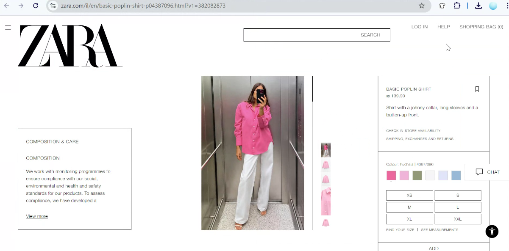
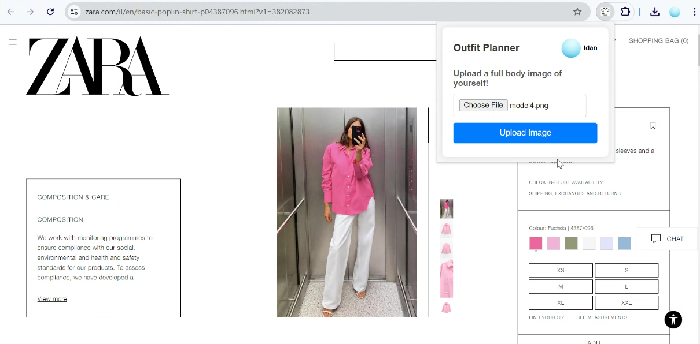
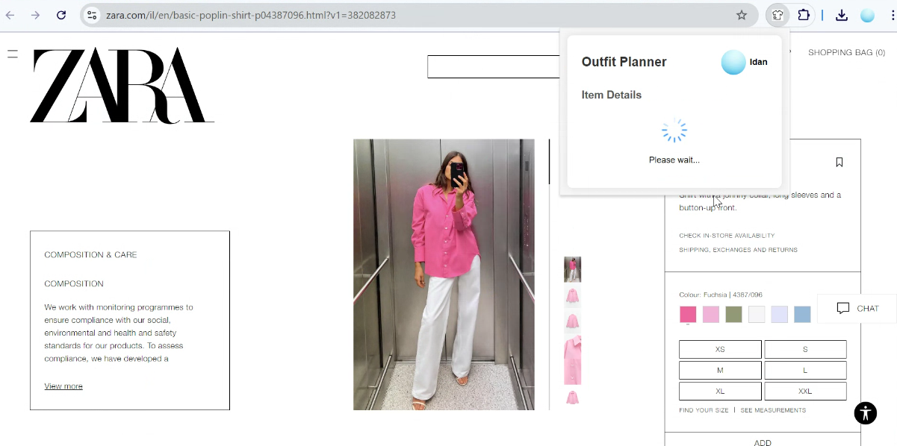
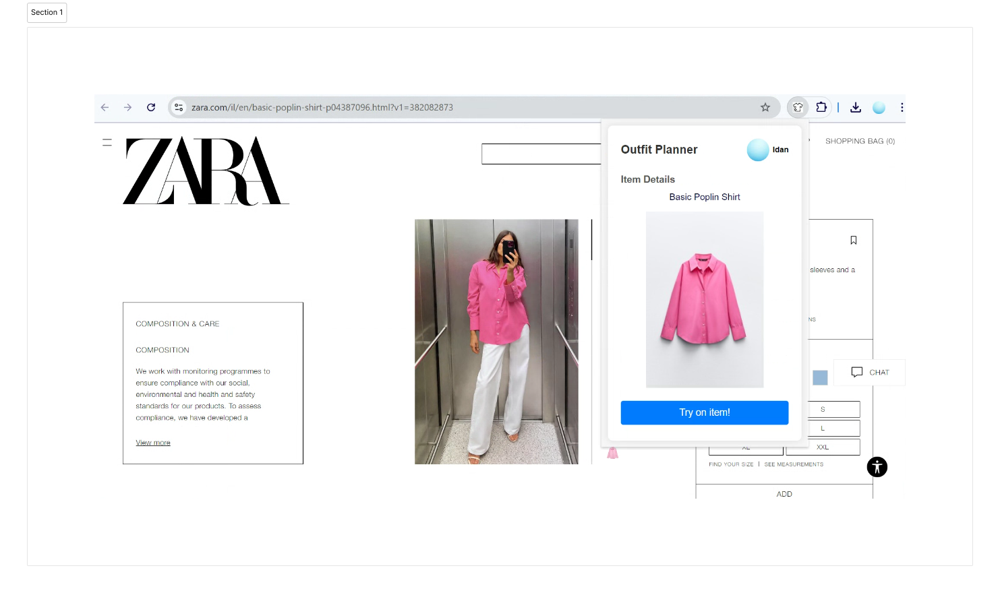
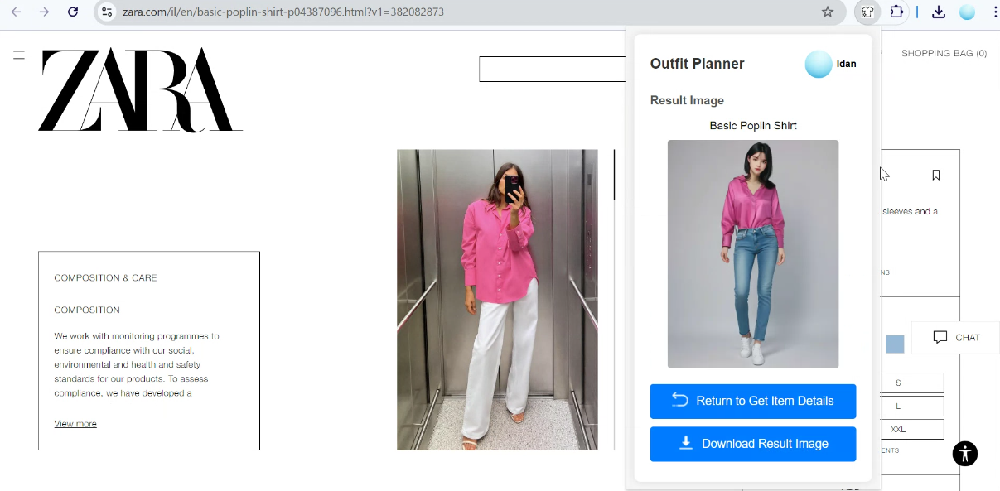

# Outfit Planner Chrome Extension - Try before you buy!

A Chrome extension that models the requested clothing items on the user to help improve the online buying experience on the Zara site.

By: Nofar Nahum and Idan Yehiel.

## Libraries & Technologies
- YOLO
- Selenium
- CV2
- FastApi
- OOTDiffusion (Hugging Face Space)
- Google Console
- Google Analytics
- FastApi StaticsFiles
- Google OAuth2 (user authentication)

## Features
- Trying on an item of clothing of your choice on a given picture of yourself.
- The user can choose to ‘try the item again’ and get a new image.
- The user can download the image of themselves wearing the clothing item.
- Saving the user’s image for a certain amount of time in the history of the extension for trying other items with Google SignIn and Cache.

## Prerequisites
  python 3.7 - 3.11.
  
  Look at requirements.txt

## Setup

### Backend

1. **Clone the repository:**
```bash
   git clone https://github.com/idanye/outfit-planner.git
   cd outfit-planner/backend
```

2. Install dependencies:
  ```sh
  pip install -r requirements.txt
  ```

3. Run the FastAPI server:
```sh
  ./start.sh
```

4. Load the extension in Chrome:
  - Open Chrome and go to chrome://extensions/.
  - Enable "Developer mode".
  - Click "Load unpacked" and select the frontend directory.

### Configuration
manifest.json:
Ensure the manifest.json file includes the necessary permissions and OAuth2 configuration:
```sh
  "oauth2": {
    "client_id": your-client-id,
    "scopes": [
      "https://www.googleapis.com/auth/userinfo.email",
      "https://www.googleapis.com/auth/userinfo.profile"
    ]
  },
```

## The Product 
1. Open the Zara site and pick an item to try:


2. Sign in with google:


3. Upload a full-body image of yourself:


4. Wait


5. Showing the item details, click to try on:


6. Click for download the result or try again:



